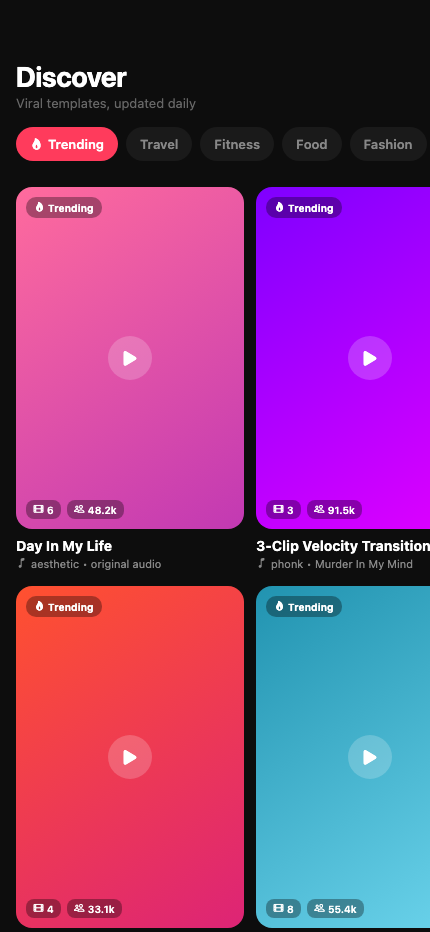

## Overview

Recut lets you remix trending short-form video formats without a real editor.
Browse the formats blowing up right now, like "Day In My Life" or multi-clip
transition edits. Pick one. Drop in your clips. Export.

## How it works

- React Native and Expo run the app and handle camera and media access. One
  codebase ships to iOS, Android, and web.
- A Node and FFmpeg server does the video work. The server stitches clips to a
  template's timing, transitions, and audio sync. Real video processing, not a
  WebView trick.
- Templates group by category: Trending, Travel, Fitness, Food, Fashion. Each
  shows engagement counts, so browsing feels like a feed, not a file picker.

## What I learned

FFmpeg in a managed host is fragile. The build in some Node images drops codecs
the audio and video sync needs, so rendering broke at random. The fix: pin the
exact FFmpeg build the server runs. Do not trust the platform default. The
lesson set the architecture. Render on the server, never in the client. Mobile
WebViews fail at frame-accurate video.

## Status

In active development.
