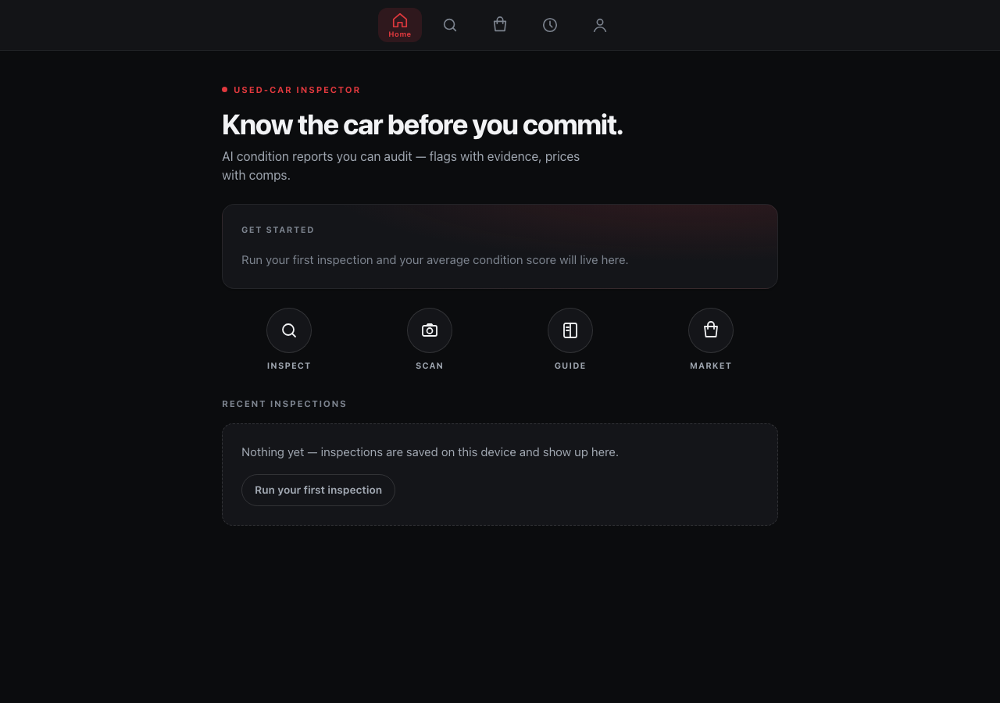
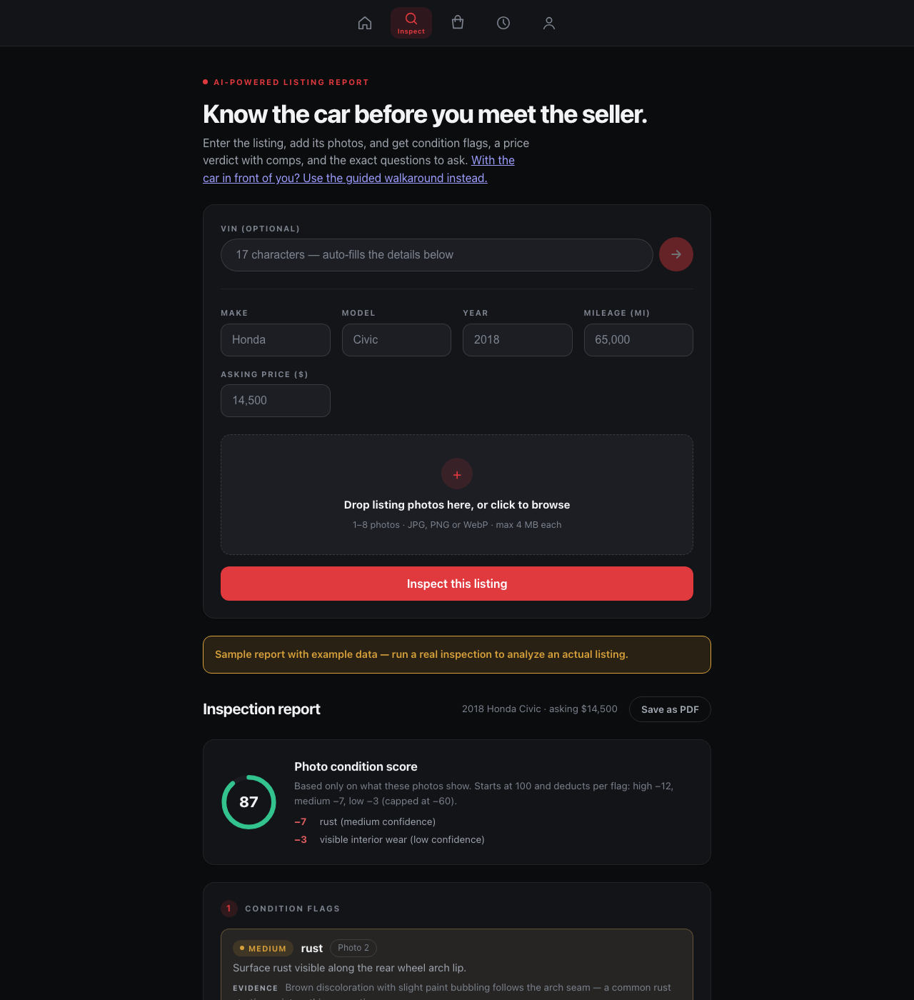

## Overview

Buying a used car from a private seller means trusting someone who knows
exactly what's wrong with the car and has no reason to tell you. Used-Car
Inspector closes that gap: upload the listing photos, get back condition
flags with visible evidence (not just a confidence number), a fair-price
range backed by real comparable listings, and the specific questions to ask
the seller.

## The core problem

Most "AI inspection" demos I'd seen just print a percentage and call it a
day — "87% confidence: damage detected." That's not trustworthy, it's just
confident-sounding. If the model can't point at *why* it thinks something's
wrong, the number is decoration. So the whole design constraint became:
**every claim has to show its work.**

## Approach

- **Two AI calls, not one black box.** A vision pass reads the photos against
  a fixed checklist (rust, panel misalignment, tire wear, warning lights,
  interior wear) and is required to say "not assessable" rather than guess
  when a photo doesn't show something clearly. A second pass reasons over
  the flags plus real comps to produce the price verdict — it can't invent
  a number with no comps behind it.
- **The condition score is a formula, not a model output.** It starts at 100
  and subtracts fixed amounts per flag by confidence tier. You can read the
  exact math on every report. No hidden score.
- **Local-first.** Inspections save to the browser, not a server — no
  account, nothing to leak.

## Challenges & lessons

The hard part wasn't the AI call, it was **making the AI say "I don't
know."** Models default to confident-sounding answers; getting the vision
pass to reliably flag "not assessable" for a blurry or oddly-angled photo
took several rounds of prompt tightening and a validation pass on the output
schema before I trusted it enough to ship.

## Status

Actively developed. Source is private for now.
